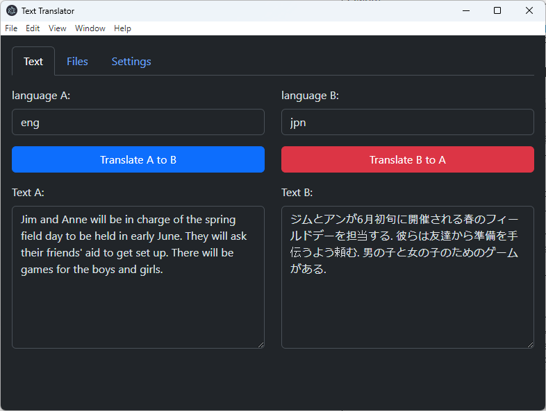
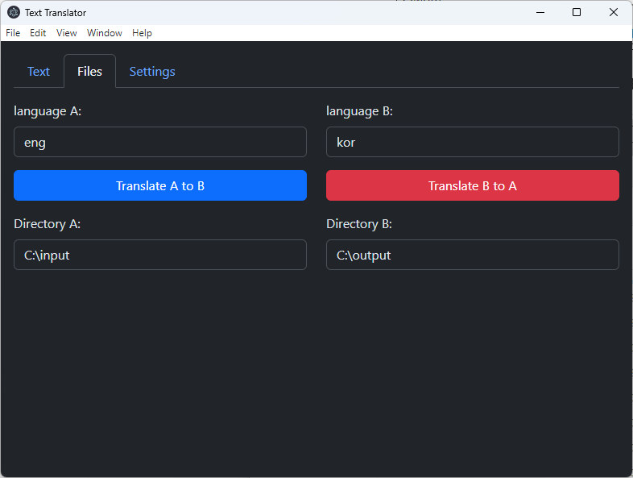
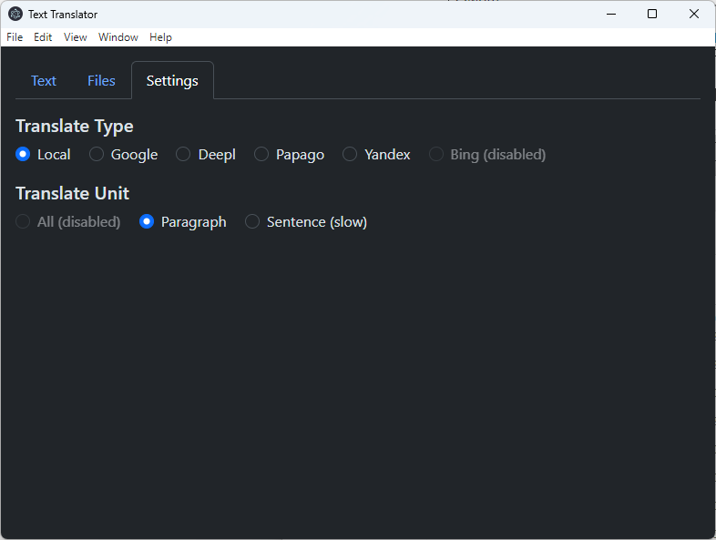

# tt

Text translator with electron.

## Text

1. Type to Text A. (source text)
2. If Language A (source language) is not matched, replace Language A manually.
3. Type Language B (destination language)
4. Click Translate A to B

  

## TXT files

1. Type to Directory A. (directory path)
2. Type to Directory B. (directory path)
3. If Language A (source language) is not matched, replace Language A manually.
4. Type Language B (destination language)
4. Click Translate A to B

  

## Settings

#### Translate Type

- NLLB-200: Use NLLB-200 models (Take a lot of time for downloading in first translate.)
- google
- deepl
- papago
- yandex
- bing: Disabled
- reverso

#### Translate Unit

- All: Disabled
- Paragraph: Default
- Line: 
- Sentence: Slow

  

## Updates

- 5/23/2024
  Add all NLLB models.
  Add translateByLine.
  Add reverso.
  Add txt preview.
  Web timeout: 30s => 10s

## References

- [nllb-200-high-quality-machine-translation](https://ai.meta.com/blog/nllb-200-high-quality-machine-translation/ko/)